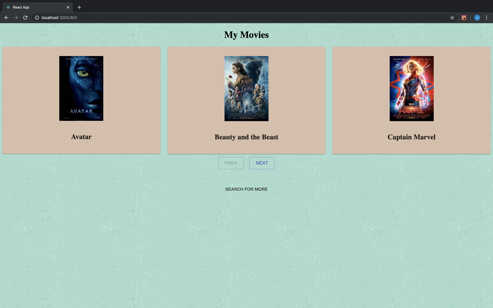
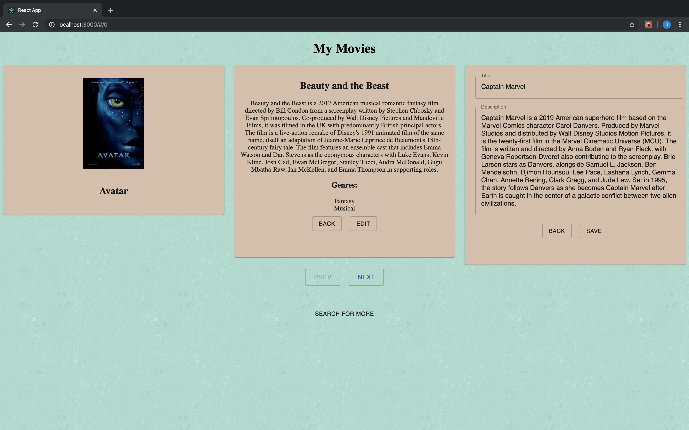
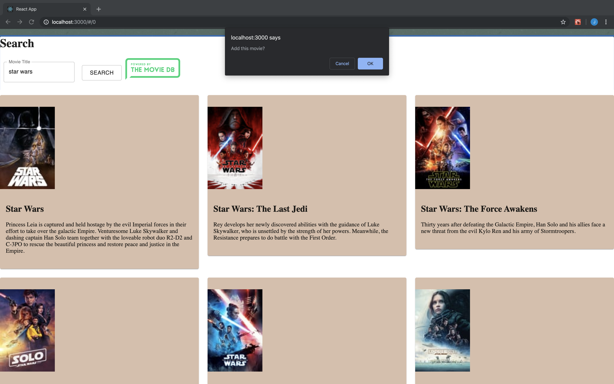

# Movie Sagas

## [Demo](http://movies.mynameisjon.com/)

## Description
Duration: Weekend Project

A web app to track your growing movie collection.

## Screen Shot

## Prerequisites
\
[Node.js](https://nodejs.org/en/)

[PostgreSQL](https://www.postgresql.org/)

## Installation
1. Create a database named `saga_movies_weekend`
2. Use the queries in `database.sql` to set up the tables.
3. From the base directory in your terminal run `npm install` to grab the necessary dependencies. This may take some time.
4. Run `npm run server`
5. In another terminal instance run `npm run client`, the site will load in your default browser. Follow the prompts in your terminal if it cannot determine the default.

## Usage
- Movies display alphabetically 3 at a time. Navigation is done with the `prev` and `next` buttons at the bottom of the page.

- Clicking on a Movie's poster displays more information about the movie as well as an option to edit that information on the database.

- Using the search button at the bottom of the page additional movies can be added to the database. Search by movie title, click on the movie card you would like to add, and confirm your selection.

## Built With
- React
- Material-UI
- javascript
- express
- node.js
- postgreSQL